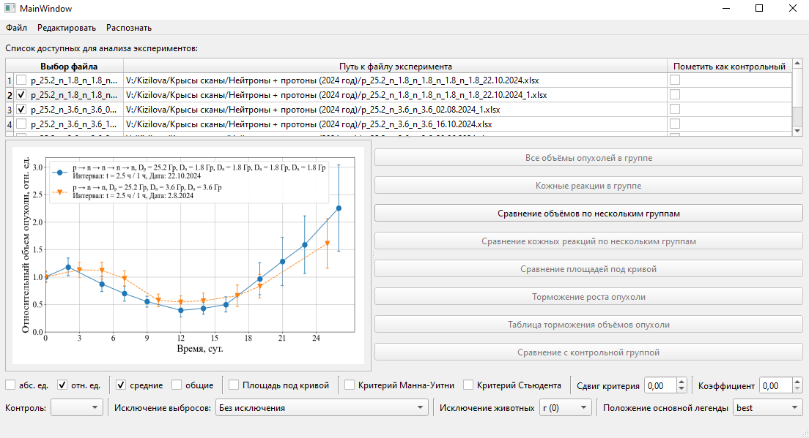

### Neuro Stats — инструменты анализа и визуализации

Репозиторий с наборами инструментов для обработки данных в радиобиологических исследованиях: загрузка Excel-данных, визуализация, статистический анализ, GUI и утилиты для подгонки параметров линейно‑квадратичной модели (LQ, α/β).

---

### Быстрый старт

Требуется Python 3.10+.

Установка (Poetry):
```powershell
poetry install
poetry run python -V
```

Либо (pip):
```powershell
pip install -U pip
pip install -e .
```

---

### Структура репозитория

- `work_with_prepared_data/` — подготовленные данные и проекты анализа.
  - [`radiobioligy_project/`](work_with_prepared_data/radiobioligy_project/) — радиобиологический модуль (GUI, графики, статистика, LQ‑модель).
    - Подробности см. в [`README радиобиологии`](work_with_prepared_data/radiobioligy_project/README.md).
- `ui/` — дополнительные интерфейсы/конвертеры UI.
- `neuro_stats/` — часть, связанная с распознаванием текста (OCR); префикс `neuro_` относится к этой подсистеме, не к радиобиологии.
- `apple_vision/` — модуль распознавания изображений (экспериментальный).


---

### Радиобиологический модуль (GUI и CLI)

- Запуск GUI:
```powershell
python -m work_with_prepared_data.radiobioligy_project.gui.main_window
```
Альтернатива (если есть проблемы с импортами модулем):
```powershell
python .\work_with_prepared_data\radiobioligy_project\gui\main_window.py
```

- Примеры CLI:
```powershell
python .\work_with_prepared_data\radiobioligy_project\draw_base_graphs.py
python .\work_with_prepared_data\radiobioligy_project\draw_base_graphs_compare.py
python .\work_with_prepared_data\radiobioligy_project\skin_reactions_base_grapf.py
cd .\work_with_prepared_data\radiobioligy_project\survival
python .\fit_alpha_beta_using_processor.py --alpha 0.3
```

Скриншот GUI:



Подробнее: [`work_with_prepared_data/radiobioligy_project/README.md`](work_with_prepared_data/radiobioligy_project/README.md) (формат Excel‑данных, методы, советы по данным).

---

### Данные

- Примеры таблиц и наборов располагаются в `work_with_prepared_data/datas/` и подкаталогах.
- Формат: первая строка — параметры эксперимента (дозы, условия), далее строки по животным, столбцы — временные точки.


### Требования и зависимости

- Основные: PyQt6, matplotlib, numpy, pandas, scipy, scikit-learn, fastdtw и др.
- Управление зависимостями: Poetry (`pyproject.toml`, `poetry.lock`).

---

### Подсказки по запуску

- Windows PowerShell: используйте модульный запуск `python -m`, чтобы избежать проблем с `PYTHONPATH`.
- Matplotlib + Qt: при необходимости установите PyQt6; в некоторых модулях установлен бэкенд `QT5Agg`.

---

### Лицензия и назначение

Код предоставляется для исследовательских целей. Проверьте применимость методик к вашим данным и корректность интерпретации результатов перед публикацией.


